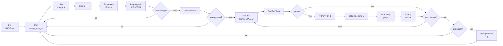

# Wang 2022 HNO 公式与本工程代码对应说明

本文档用于建立 Wang et al., 2022 的 HNO 非线性观测器公式与本工程
`HNOPropagator.cpp`、`HNOUpdater.cpp` 之间的对应关系。PDF 文本识别可能会把上标、转置和叉乘符号识别错误；涉及实现细节时，以当前 C++ 代码为准。

本工程实现的核心不是纯连续视觉观测器，而是论文中的 hybrid observer：IMU 高频传播，视觉观测在图像帧到达时做离散跳变更新。

## 1. 坐标系、状态量与代码变量

论文中的刚体状态为：

$$
R \in SO(3), \quad p \in \mathbb{R}^3, \quad v \in \mathbb{R}^3
$$

其中 $R$ 表示 body frame 到 inertial frame 的姿态，$p,v$ 在 inertial frame 中表达。本工程对应：

| 理论符号 | 代码变量 | 含义 |
| --- | --- | --- |
| $\hat{R}$ | `state->R_hat_B2I` | body 到 inertial 的估计旋转 |
| $\hat{p}$ | `state->p_hat` | inertial frame 下的位置 |
| $\hat{v}$ | `state->v_hat` | inertial frame 下的速度 |
| $\hat{e}_i$ | `state->e_hat[i]` | inertial frame 下的辅助基向量估计 |
| $b_g,b_a$ | `state->bg`, `state->ba` | IMU 零偏，传播前从测量中扣除 |
| $P$ | `state->P` | 15 维误差状态协方差 |

15 维误差状态在代码中的顺序为：

$$
x = [p^\top, e_1^\top, e_2^\top, e_3^\top, v^\top]^\top
$$

对应 `P` 的 block 顺序：

```text
0:2    position
3:5    e1
6:8    e2
9:11   e3
12:14  velocity
```

代码中每次视觉更新得到的 `delta = K * sigma_y_i` 是 body-frame 误差修正量，因此真正加到状态时要左乘当前姿态估计：

$$
\delta x_I = \hat{R}\,\delta x_B
$$

对应代码：

```cpp
state->p_hat    += R_hat_B2I * delta.segment<3>(0);
state->e_hat[0] += R_hat_B2I * delta.segment<3>(3);
state->e_hat[1] += R_hat_B2I * delta.segment<3>(6);
state->e_hat[2] += R_hat_B2I * delta.segment<3>(9);
state->v_hat    += R_hat_B2I * delta.segment<3>(12);
```

## 2. 论文连续观测器与本工程 hybrid 实现的区别

论文连续形式 Eq. 6 可以写为：

$$
\begin{aligned}
\dot{\hat{R}} &= \hat{R}(\omega + \hat{R}^\top \sigma_R)^\times \\
\dot{\hat{p}} &= \hat{v} + \sigma_R^\times \hat{p} + \hat{R} K_p \sigma_y \\
\dot{\hat{v}} &= \hat{g} + \hat{R} a + \sigma_R^\times \hat{v} + \hat{R} K_v \sigma_y \\
\dot{\hat{e}}_i &= \sigma_R^\times \hat{e}_i + \hat{R} K_i \sigma_y
\end{aligned}
$$

但实际相机帧是离散到达的。本工程采用论文 Section V / Algorithm 1 对应的 hybrid 形式：

连续传播阶段：

$$
\begin{aligned}
\dot{\hat{R}} &= \hat{R}(\omega + \hat{R}^\top \sigma_R)^\times \\
\dot{\hat{p}} &= \hat{v} + \sigma_R^\times \hat{p} \\
\dot{\hat{v}} &= \hat{g} + \hat{R}a + \sigma_R^\times \hat{v} \\
\dot{\hat{e}}_i &= \sigma_R^\times \hat{e}_i
\end{aligned}
$$

视觉帧到达时：

$$
\begin{aligned}
\hat{R}^+ &= \hat{R} \\
\hat{p}^+ &= \hat{p} + \hat{R}K_p\sigma_y \\
\hat{v}^+ &= \hat{v} + \hat{R}K_v\sigma_y \\
\hat{e}_i^+ &= \hat{e}_i + \hat{R}K_i\sigma_y
\end{aligned}
$$

对应关系：

- `HNOPropagator::propagate()` 实现连续传播阶段。
- `HNOUpdater::update()` 实现视觉帧到达时的离散更新。
- 因此 `HNOPropagator.cpp` 中没有 `R_hat * K * sigma_y` 项，这是 hybrid 形式下的正确实现，不是漏项。

## 3. Algorithm 1 到工程代码的总流程

### 3.1 论文 Algorithm 1 的结构

Wang 2022 原文给出的 Algorithm 1 可整理为下面的表格伪代码。它的核心结构是：IMU 区间内连续传播；视觉测量到达 $t_k$ 时，计算 $\sigma_y$、$C(t_k)$ 和 $K$，再执行状态与协方差的离散跳变。

| 行号 | Algorithm 1: Nonlinear Observer for Vision-Aided INSs. |
| ---: | --- |
| Input | Continuous IMU measurements, and intermittent visual measurements at the time instants $\{t_k\}_{k\in\mathbb{N}_{>0}}$. |
| Output | $\hat{R}(t)$, $\hat{p}(t)$ and $\hat{v}(t)$ for all $t \ge 0$. |
| 1 | **for** $k \ge 1$ **do** |
| 2 | &emsp;**while** $t \in [t_{k-1}, t_k]$ **do** |
| 3 | &emsp;&emsp;$\dot{\hat{R}}=\hat{R}(\omega+\hat{R}^{\top}\sigma_R)^\times$，其中 $\sigma_R$ defined in Eq. 7 |
| 4 | &emsp;&emsp;$\dot{\hat{p}}=\sigma_R^\times\hat{p}+\hat{v}$ |
| 5 | &emsp;&emsp;$\dot{\hat{v}}=\sigma_R^\times\hat{v}+\sum_{i=1}^{3}g_i\hat{e}_i+\hat{R}a$ |
| 6 | &emsp;&emsp;$\dot{\hat{e}}_i=\sigma_R^\times\hat{e}_i,\quad i=1,2,3$ |
| 7 | &emsp;&emsp;$\dot{P}=A(t)P+PA^\top(t)+V(t)$，其中 $A(t)$ defined in Eq. 10，$V(t)$ uniformly positive definite |
| 8 | &emsp;**end while** |
| 9 | &emsp;Obtain $\sigma_y$ and $C(t)$ from visual measurements at $t_k$；stereo 使用 Eq. 11/12，monocular 使用 Eq. 13/14 |
| 10 | &emsp;$K=PC^\top(t_k)\left(C(t_k)PC^\top(t_k)+Q^{-1}(t_k)\right)^{-1}$，其中 $Q(t)$ uniformly positive definite |
| 11 | &emsp;Compute $K_p,K_1,K_2,K_3,K_v$ from $K=[K_p^\top,K_1^\top,K_2^\top,K_3^\top,K_v^\top]^\top$ |
| 12 | &emsp;$\hat{R}^{+}=\hat{R}$ |
| 13 | &emsp;$\hat{p}^{+}=\hat{p}+\hat{R}K_p\sigma_y$ |
| 14 | &emsp;$\hat{v}^{+}=\hat{v}+\hat{R}K_v\sigma_y$ |
| 15 | &emsp;$\hat{e}_i^{+}=\hat{e}_i+\hat{R}K_i\sigma_y,\quad i=1,2,3$ |
| 16 | &emsp;$P^{+}=(I_{15}-KC)P$ |
| 17 | **end for** |

### 3.2 工程代码横向流程图

下面的横向流程图对应论文 Algorithm 1，也对应本工程一次运行时 `HNOPropagator` 与 `HNOUpdater` 的衔接关系：



如果渲染环境不支持 Mermaid，可按下表理解同一流程：

| 阶段 | 论文 Algorithm 1 | 本工程代码 | 输出到下一阶段 |
| --- | --- | --- | --- |
| 初始化 | 设定 $\hat{R},\hat{p},\hat{v},\hat{e}_i,P$ | `HNOState` / initializer | 初始状态与协方差 |
| IMU 传播 | lines 2-8 | `HNOPropagator::propagate()` | 连续传播后的状态与 $P$ |
| 视觉观测构造 | line 9 | 前端生成 `HNOObservation` | bearing、landmark 系数、右目有效标志 |
| 视觉增益 | line 10 | `K = P C_i^T S_i^{-1}` | 单 feature 的更新增益 |
| 状态跳变 | lines 12-15 | `state += R_hat_B2I * delta` | 更新后的 $\hat{p},\hat{v},\hat{e}_i$ |
| 协方差跳变 | line 16 | Joseph form | 更新后的 $P$ |
| 工程保护 | 论文未显式包含 | 低观测数、chi2、增量截断、结构投影 | 抑制异常观测和数值漂移 |

整体上可以把算法理解为一个两速率闭环：IMU 每来一次就传播状态和协方差；图像帧到达时，视觉残差通过 $C_i$ 和 $K_i$ 离散修正平移、速度和辅助基向量，然后把修正后的状态继续交给下一轮 IMU 传播。

## 4. 姿态修正项 $\sigma_R$

论文 Eq. 7 的姿态创新项在工程中实现为：

$$
\sigma_R =
\frac{k_R}{2}
\sum_{i=1}^{3}
\rho_i(\hat{e}_i \times e_i)
$$

其中 $e_1,e_2,e_3$ 是 inertial frame 的标准基：

$$
e_1=[1,0,0]^\top,\quad e_2=[0,1,0]^\top,\quad e_3=[0,0,1]^\top
$$

代码对应：

```cpp
rho << 0.5, 0.3, 0.2;
k_R = 20.0;

for(int i=0; i<3; i++) {
    sigma_R += rho[i] * e_hat[i].cross(e[i]);
}
sigma_R *= (0.5 * k_R);
```

这里 $\sigma_R$ 在 inertial frame 中表达，传播姿态时转换为 body frame 修正角速度：

$$
\omega_{\text{total}} = \omega + \hat{R}^\top \sigma_R
$$

对应：

```cpp
Eigen::Vector3d omega_total = omega + R_hat_B2I.transpose() * sigma_R;
state->R_hat_B2I = state->R_hat_B2I * Exp(omega_total * dt);
```

代码用 `Eigen::AngleAxisd` 实现指数映射，因此姿态传播保持在 $SO(3)$ 上，比直接欧拉积分旋转矩阵更稳。

## 5. IMU 传播方程

IMU 原始测量先扣除零偏：

$$
\omega = \omega_m - b_g,\quad a = a_m - b_a
$$

对应：

```cpp
Eigen::Vector3d omega = omega_m - state->bg;
Eigen::Vector3d accel = acc_m - state->ba;
```

位置、速度、辅助基向量传播为：

$$
\begin{aligned}
\dot{\hat{p}} &= \hat{v} + \sigma_R^\times \hat{p} \\
\hat{g} &= \sum_{i=1}^{3} g_i \hat{e}_i \\
\dot{\hat{v}} &= \hat{g} + \hat{R}a + \sigma_R^\times \hat{v} \\
\dot{\hat{e}}_i &= \sigma_R^\times \hat{e}_i
\end{aligned}
$$

对应代码：

```cpp
Eigen::Matrix3d Sigma_R = skew(sigma_R);
Eigen::Vector3d dp = v_hat + Sigma_R * p_hat;

Eigen::Vector3d g_hat = Eigen::Vector3d::Zero();
for(int i=0; i<3; i++) g_hat += gravity[i] * e_hat[i];

Eigen::Vector3d dv = g_hat + R_hat_B2I * accel + Sigma_R * v_hat;
for(int i=0; i<3; i++) de_hat[i] = Sigma_R * e_hat[i];
```

其中 `gravity = [0, 0, -9.81]^T`。代码对 $p,v,e_i$ 使用显式欧拉积分，对 $R$ 使用指数映射更新。

## 6. 视觉 bearing 观测模型

论文中 bearing 观测使用投影算子：

$$
\pi(x) = I_3 - xx^\top,\quad x \in S^2
$$

它把任意向量投影到与 bearing 方向正交的平面。代码实现为：

```cpp
Eigen::Matrix3d HNOUpdater::project_pi(const Eigen::Vector3d& x) {
    Eigen::Vector3d n = x.normalized();
    return Eigen::Matrix3d::Identity() - n * n.transpose();
}
```

`HNOObservation` 中：

| 代码变量 | 理论含义 |
| --- | --- |
| `uv_left`, `uv_right` | 相机系归一化 bearing $y_i^s$ |
| `xyz` | landmark 在固定 inertial basis 下的系数 $[p_{i1},p_{i2},p_{i3}]^\top$ |
| `isValidRight` | 是否有右目 bearing |

工程中的相机外参是 Camera-to-Body：

| 代码变量 | 含义 |
| --- | --- |
| `R_C2B_left/right` | 将相机系向量旋到 body frame |
| `pc_left/right` | 相机原点在 body frame 下的位置 |

因此 body frame 下的投影矩阵为：

$$
\Pi_{is} = R_{C_sB}\,\pi(y_i^s)\,R_{C_sB}^\top
          = \pi(R_{C_sB}y_i^s)
$$

代码左目：

```cpp
pi_left = R_C2B_left * project_pi(feature.uv_left) * R_C2B_left.transpose();
sigma_y_left = pi_left * (pf_hat_B - pc_left);
```

右目有效时：

```cpp
pi_right = R_C2B_right * project_pi(feature.uv_right) * R_C2B_right.transpose();
sigma_y_right = pi_right * (pf_hat_B - pc_right);
```

双目总 innovation：

$$
\sigma_{y_i}
=
\sum_{s \in \{L,R\}}
\Pi_{is}(\hat{R}^\top(\hat{p}_i-\hat{p}) - p_{c_s})
$$

代码对应：

```cpp
Eigen::Vector3d sigma_y_i = sigma_y_left + sigma_y_right;
Eigen::Matrix3d Pi_total = pi_left + pi_right;
```

如果右目不可用，`pi_right=0`，该式自然退化为单目 bearing 更新。

## 7. Landmark 重构与 $C_i$ 矩阵

论文中 landmark $p_i$ 是 inertial frame 中已知的固定点：

$$
p_i = \sum_{j=1}^{3} p_{ij} e_j
$$

观测器中使用辅助基向量构造估计 landmark：

$$
\hat{p}_i = \sum_{j=1}^{3} p_{ij}\hat{e}_j
$$

代码对应：

```cpp
double p_i1 = feature.xyz(0);
double p_i2 = feature.xyz(1);
double p_i3 = feature.xyz(2);

Eigen::Vector3d pf_hat_I = p_i1 * state->e_hat[0] +
                           p_i2 * state->e_hat[1] +
                           p_i3 * state->e_hat[2];
Eigen::Vector3d pf_hat_B = R_hat_B2I.transpose() * (pf_hat_I - p_hat);
```

因此本工程对 `feature.xyz` 的数学约定是：它提供 $p_{i1},p_{i2},p_{i3}$，也就是 landmark 在固定 inertial basis $e_j$ 下的坐标系数。代码再用当前 $\hat{e}_j$ 重构 $\hat{p}_i$。

对单个 feature，论文 Eq. 12 / Eq. 14 的一行观测矩阵在代码中写为：

$$
C_i =
\begin{bmatrix}
\Pi_i &
-p_{i1}\Pi_i &
-p_{i2}\Pi_i &
-p_{i3}\Pi_i &
0_{3\times3}
\end{bmatrix}
$$

其中：

$$
\Pi_i = \Pi_{iL} + \Pi_{iR}
$$

代码对应：

```cpp
C_i.block<3,3>(0, 0) = Pi_total;
C_i.block<3,3>(0, 3) = -p_i1 * Pi_total;
C_i.block<3,3>(0, 6) = -p_i2 * Pi_total;
C_i.block<3,3>(0, 9) = -p_i3 * Pi_total;
```

最后速度 block 为零，因为 bearing 观测不直接测速度。

## 8. 协方差传播：$A(t)$、$G_t$ 与 $V(t)$

论文 Eq. 10 的误差系统矩阵 $A(t)$ 在代码中为 15x15 block matrix：

$$
A(t)=
\begin{bmatrix}
-\omega^\times & 0 & 0 & 0 & I \\
0 & -\omega^\times & 0 & 0 & 0 \\
0 & 0 & -\omega^\times & 0 & 0 \\
0 & 0 & 0 & -\omega^\times & 0 \\
0 & g_1I & g_2I & g_3I & -\omega^\times
\end{bmatrix}
$$

代码对应：

```cpp
for(int k=0; k<5; k++) A.block<3,3>(3*k, 3*k) = -skew(omega);
A.block<3,3>(0, 12) = Eigen::Matrix3d::Identity();
A.block<3,3>(12, 3) = gravity(0) * Eigen::Matrix3d::Identity();
A.block<3,3>(12, 6) = gravity(1) * Eigen::Matrix3d::Identity();
A.block<3,3>(12, 9) = gravity(2) * Eigen::Matrix3d::Identity();
```

hybrid 传播阶段的协方差方程为：

$$
\dot{P}=A(t)P+PA(t)^\top+V(t)
$$

过程噪声项来自论文 Eq. 27a：

$$
V(t)=G_t\,\mathrm{Cov}(n_x)\,G_t^\top
$$

代码中的 $G_t$ 为：

$$
G_t =
\begin{bmatrix}
(\hat{R}^\top \hat{p})^\times & 0 \\
(\hat{R}^\top \hat{e}_1)^\times & 0 \\
(\hat{R}^\top \hat{e}_2)^\times & 0 \\
(\hat{R}^\top \hat{e}_3)^\times & 0 \\
(\hat{R}^\top \hat{v})^\times & -I
\end{bmatrix}
$$

论文中可能带整体负号；在 $V=GQG^\top$ 中整体负号会抵消，因此代码省略该负号。

代码中 IMU 噪声协方差为：

```cpp
Cov_nx.block<3,3>(0, 0) = 35 * var_gyro * I;
Cov_nx.block<3,3>(3, 3) = 35 * var_acc  * I;
```

协方差积分使用 RK4：

```cpp
state->P = RK4(A, state->P, Vt, dt);
state->P = 0.5 * (state->P + state->P.transpose());
```

其中 `RK4()` 内部导数是：

$$
f(P)=AP+PA^\top+V
$$

## 9. 离散视觉更新：增益、卡方检验与 Joseph 形式

论文 hybrid 更新的增益为：

$$
K = P C^\top (CPC^\top + Q^{-1})^{-1}
$$

代码按 feature 序贯更新，每个 feature 构造一个 $3\times15$ 的 $C_i$。这等价于把堆叠观测分块处理，前提是各 feature 的观测噪声近似独立。

代码中的创新协方差：

$$
S_i = C_i P C_i^\top + Q_i
$$

其中 `Q_i` 对应论文 Eq. 24 中加在括号内的 $Q^{-1}$，也对应 Eq. 27b 的 innovation-space measurement covariance：

$$
Q^{-1}(t)=M_t\,\mathrm{Cov}(n_y)\,M_t^\top
$$

代码近似为：

$$
Q_i =
\|\hat{R}^\top(\hat{p}_i-\hat{p})\|^2
\left(\frac{\sigma_{\text{pix}}}{f}\right)^2
\Pi_i
+ \epsilon I
$$

实际代码写法：

```cpp
double sigma_pix = options_.pixel_noise / options_.focal_length;
double dist_sq = pf_hat_B.squaredNorm();
Eigen::Matrix3d Q_i = (dist_sq * sigma_pix_sq) * Pi_total;
Q_i += 1e-8 * Eigen::Matrix3d::Identity();
```

卡方门限用于拒绝异常观测：

$$
\chi_i^2 = \sigma_{y_i}^\top S_i^{-1}\sigma_{y_i}
$$

对应：

```cpp
double chi2 = sigma_y_i.transpose() * llt.solve(sigma_y_i);
if (chi2 > options_.chi2_gate) continue;
```

通过门限后：

$$
K_i = P C_i^\top S_i^{-1},\quad
\delta x_i = K_i\sigma_{y_i}
$$

对应：

```cpp
Eigen::Matrix<double, 15, 3> K = PHT * llt.solve(Eigen::Matrix3d::Identity());
Eigen::VectorXd delta = K * sigma_y_i;
```

论文 Algorithm 1 中协方差跳变写作：

$$
P^+ = (I-KC)P
$$

本工程使用 Joseph form：

$$
P^+ =
(I-KC)P(I-KC)^\top + KQ_iK^\top
$$

代码对应：

```cpp
Eigen::Matrix<double, 15, 15> I_KH =
    Eigen::Matrix<double, 15, 15>::Identity() - K * C_i;
state->P = I_KH * state->P * I_KH.transpose() + K * Q_i * K.transpose();
state->P = 0.5 * (state->P + state->P.transpose());
```

Joseph form 与标准 Kalman 更新等价于同一线性观测假设下的数值稳定写法，能更好保持 $P$ 对称和半正定。

## 10. 工程保护项与理论公式的关系

以下机制不是论文核心公式的一部分，而是为了在真实 EuRoC 数据、有限数值精度和前端异常观测下提高稳定性。

### 10.1 低观测数保护

当 feature 数量低于 `min_observations` 且连续低观测持续超过阈值时，跳过更新：

```cpp
if(N < options_.min_observations) { ... return; }
```

目的：避免少量退化 feature 对状态产生过强修正。

### 10.2 增量截断

代码限制单次 feature 更新的修正幅度：

```cpp
if (delta_p > effective_max_delta_p) continue;
if (delta_r > effective_max_delta_r) continue;
```

其中 `delta_r` 当前取 `delta.segment<3>(3)` 的范数，也就是 `e1` block 的修正量，作为旋转/结构增量的代理指标；它不是直接对 `R_hat_B2I` 做旋转更新。这个命名服务于调试日志，数学上应理解为辅助基向量修正量大小的保护阈值。

### 10.3 协方差下限与异常重置

代码对 $P$ 做对称化、负对角检查和最小对角线限制：

```cpp
state->P = 0.5 * (state->P + state->P.transpose());
if(state->P(i,i) < 1e-9) state->P(i,i) = 1e-9;
```

目的：防止数值上过度自信，使后续视觉观测仍能产生有效增益。

### 10.4 结构投影

理论上 $\hat{R}\in SO(3)$，辅助向量 $\hat{e}_i$ 应收敛到 inertial basis。代码中姿态通过指数映射维护正交性；此外可选调用：

```cpp
state->enforce_structure();
```

该函数对 `R_hat_B2I` 和 `E=[e_hat_1,e_hat_2,e_hat_3]` 做 SVD 正交投影：

$$
E \leftarrow \arg\min_{Q\in O(3)}\|E-Q\|_F
$$

当前代码使用 $UV^\top$，没有额外做 `det=+1` 修正；在状态接近正常旋转时它等价于最近旋转矩阵的数值投影。该步骤属于工程稳定化手段，用于抑制长期数值漂移和异常视觉更新导致的结构破坏。

## 11. 从公式到代码的执行顺序

一次 IMU + 图像序列运行时，本工程的实际计算顺序为：

1. 每个 IMU 到达时调用 `HNOPropagator::propagate()`。
2. 扣除 IMU bias，计算 $\sigma_R$。
3. 传播 $\hat{p},\hat{v},\hat{e}_i$，用指数映射传播 $\hat{R}$。
4. 构造 $A(t)$、$G_t$、$V(t)$，用 RK4 传播 $P$。
5. 图像帧到达时，前端生成若干 `HNOObservation`。
6. `HNOUpdater::update()` 对每个 observation 重构 $\hat{p}_i$ 和 bearing residual。
7. 构造 $\Pi_i$、$C_i$、$Q_i$、$S_i$。
8. 通过 NaN 检查、卡方检验和增量截断后，执行 $\delta x=K\sigma_y$。
9. 将 body-frame correction 乘 $\hat{R}$ 后加到 inertial-frame 状态。
10. 用 Joseph form 更新 $P$，必要时执行结构投影。

## 12. 当前文档使用边界

这份文档适合用于论文和答辩中说明：

- HNO 非线性观测器的理论来源；
- 为什么工程实现分成 IMU propagation 与 vision update；
- `HNOPropagator.cpp` 中每个传播项对应的理论公式；
- `HNOUpdater.cpp` 中 $\sigma_y$、$C_i$、$Q_i$、$K$ 和 $P$ 更新的来源；
- 工程保护项与理论公式之间的区别。

不建议把工程保护项描述为 Wang 2022 原始理论贡献。答辩中应表述为：基于 Wang 2022 的 hybrid nonlinear observer，本工程增加了序贯更新、卡方门限、增量截断、Joseph 协方差更新和可选结构投影，以适配真实 EuRoC 数据和离线 RTAB-Map 评估链路。
