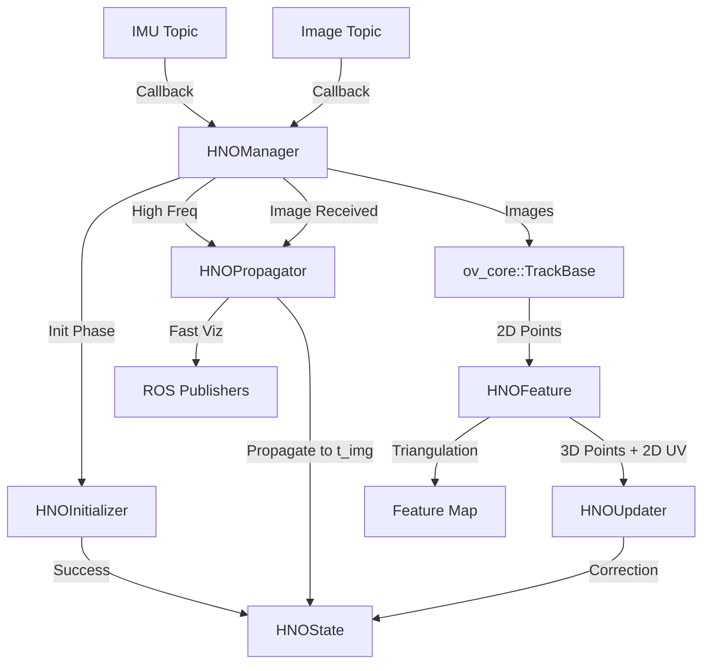

# OpenVINS Hybrid Nonlinear Observer (ov_hno) Package

This package implements the Hybrid Nonlinear Observer (HNO) for visual-inertial odometry within the OpenVINS framework. It replaces the standard MSCKF/EKF backend with a custom observer structure designed for specific theoretical properties (e.g., invariant to group actions, specific stability guarantees).

## File Structure

### Core Components (Backend)
*   **`HNOState.h`**: Defines the system state vector.
    *   Variables: Orientation ($R$), Position ($p$), Velocity ($v$), Auxiliary vectors ($e_i$), Biases ($b_g, b_a$).
    *   Covariance matrix ($P$).
*   **`HNOPropagator.h/.cpp`**:  Implements the continuous-time dynamics propagation.
    *   Takes IMU measurements ($\omega_m, a_m$) and propagates the state estimate.
    *   Computes the state transition matrix ($A$) to propagate the covariance ($P$).
*   **`HNOUpdater.h/.cpp`**: Implements the discrete-time measurement update.
    *   Takes visual feature observations (normalized coordinates).
    *   Computes the Kalman Gain ($K$) and error state ($\delta x$).
    *   Updates the state using the error state.

### Frontend & Management
*   **`HNOManager.h/.cpp`**: The central orchestration class.
    *   **Roles**:
        *   ROS Interface: Subscribes to IMU/Image topics, publishes Odometry/Path/TF.
        *   Synchronization: Buffers IMU data to align with camera frames.
        *   Flow Control: Calls Propagator and Updater in sequence.
    *   **Data Flow**:
        1.  `feed_measurement(ImuData)` -> Buffer IMU -> fast propagate for high-freq viz.
        2.  `feed_measurement(CameraData)` -> Propagate state to image time -> Track features -> Update state.
*   **`HNOFeature.h/.cpp`**: Handles visual feature logic.
    *   Manages the map of active 3D landmarks (`feature_map`).
    *   Performs stereo triangulation to initialize new landmarks.
    *   Prepares data vectors (`uv`, `xyz`) for the backend updater.
*   **`HNOInitializer.h/.cpp`**: Handles system initialization.
    *   Buffers initial IMU data.
    *   Computes initial gravity alignment ($R_0$) and gyro bias ($b_g$).

### Supporting Files
*   **`run_subscribe_hno.cpp`**: The ROS Node entry point.
*   **`HNOEstimator.h/.cpp`** *(Deprecated/Removed)*: Previously acted as a wrapper, now removed in favor of direct component management in `HNOManager`.

## Data Flow Diagram

